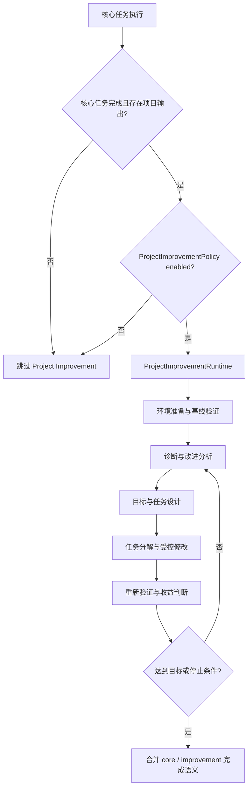

# Project Improvement 架构调查与重设计约束

## 1. 文档定位

本文是 `project_improvement` 的模块级架构研究，不是实施流水账，也不是已经批准的最终重构方案。
它回答五个问题：

1. `project_improvement` 在系统中究竟指什么；
2. 它位于哪里、何时运行、负责什么；
3. 为什么该区域集中暴露了上下文、预算、权限、恢复和验收问题；
4. 当前代码已经建立了哪些防线，哪些问题仍属于结构性风险；
5. 下一版设计必须满足哪些不变量，以及哪些决策仍需单独评审。

证据口径：

- **代码确认**：可由当前生产代码和契约直接验证；
- **实验确认**：可由冻结 trajectory、provider artifact 或离线重放验证；
- **设计判断**：由现状与故障归纳出的目标约束，尚不表示实现已获批准；
- **待确认**：需要新的实验或架构决策，本文不提前下结论。

上下文拆分、completion budget 和实验实施细节，以
[PROJECT_IMPROVEMENT_CONTEXT_GOVERNANCE_PLAN.md](./PROJECT_IMPROVEMENT_CONTEXT_GOVERNANCE_PLAN.md)、
[PROJECT_IMPROVEMENT_CONTEXT_AND_COMPLETION_PLAN.md](../context_management/PROJECT_IMPROVEMENT_CONTEXT_AND_COMPLETION_PLAN.md)
和 [PROJECT_IMPROVEMENT_CONTEXT_AB_PLAN.md](../context_management/PROJECT_IMPROVEMENT_CONTEXT_AB_PLAN.md)
为准。本文只建立模块全貌和重设计边界。

## 2. 先澄清名称：它不是一个单独函数

当前代码中，`project_improvement` 至少有三层含义：

| 名称 | 实际含义 | 主要位置 |
|---|---|---|
| Project Improvement stage | 核心任务成功后的整个增强阶段 | `runtime_controller.py`、`project_improvement_runtime.py`、`iteration_agent.py` |
| `project_improvement_tool` | 为下一轮增强生成受约束分析增量的工具 | `tool/project_improvement_tool.py` |
| `ContextRequestPurpose.PROJECT_IMPROVEMENT` | 一类 LLM 请求的上下文、预算、reasoning 和诊断归因 | `metadata`、context assembly、completion coordinator |

因此，“`project_improvement` 出错”不能直接等同于“分析工具出错”。历史上有些失败发生在后续
`iteration_task_design`、代码生成、环境准备、mutation guard、验证或顶层完成合并阶段。
调查时必须至少记录 `stage + purpose + tool + attempt`，不能只记录一个宽泛模块名。

## 3. 模块在完整架构中的位置

### 3.1 调用时机

**代码确认：** 主任务分解和执行完成后，runtime controller 会先收集写入文件并推断项目路径。
只有同时满足以下条件，才可能进入增强阶段：

- 核心 subtasks 已完成；
- 能推断项目路径；
- 存在写入文件；
- `ProjectImprovementPolicy` 没有禁用增强。

它不是核心任务执行器内部的一次普通工具调用，而是核心执行后的第二段有状态流水线。



### 3.2 主要文件与职责

| 文件 | 当前职责 | 不应承担的职责 |
|---|---|---|
| `metadata/agent_runtime.py` | 改进政策、状态、completion budget 等类型化事实 | 执行工具或拼接业务 Prompt |
| `autonomous_iteration/runtime_controller.py` | 判断是否进入增强、合并核心和增强结果 | 自行复制另一套增强状态机 |
| `autonomous_iteration/intelligent_autopilot.py` | 运行配置解析、服务装配、兼容入口 | 成为第二个政策或预算权威 |
| `autonomous_iteration/project_improvement_runtime.py` | 把项目、环境、预算、进度和迭代 agent 接到运行时 | 重新实现 agent 内部决策逻辑 |
| `autonomous_iteration/agents/iteration_agent.py` | 增强循环的状态机、目标/任务设计、快照、重验和停止 | 绕过权限、预算或完成证据 |
| `autonomous_iteration/tool/project_improvement_tool.py` | 生成受约束的改进分析 delta | 直接修改项目或宣称改进完成 |
| `autonomous_iteration/project_improvement_context.py` | 按 purpose 生成可选择、可追踪的上下文候选 | 成为项目事实的第二权威来源 |
| `autonomous_iteration/enhancement_completion_budget.py` | 增强阶段请求的预留、核销和有限恢复 | 判断业务质量或放宽权限 |
| `autonomous_iteration/task_executor.py` | 执行设计任务并衔接编辑、生成、验证与证据 | 用替代动作冒充原请求成功 |
| `autonomous_iteration/project_iteration.py` | 用户选择和兼容配置入口 | 在运行中独立改写多个计数副本 |

## 4. 当前运行语义

### 4.1 完成政策

**代码确认：** `ProjectImprovementPolicy` 是顶层政策契约，当前包含：

- `requirement`: `disabled | optional | required`；
- `source`: 政策来源；
- `target_successes`: 目标成功改进数；
- `max_attempts`: 最大尝试数。

`ProjectImprovementStatus` 单独记录观察结果：
`not_requested | skipped | succeeded | failed | interrupted`。

顶层完成语义是：

| Core | 政策 | Improvement | Overall |
|---|---|---|---|
| fail | 任意 | 任意 | fail |
| success | disabled | skipped | success |
| success | optional | success | success |
| success | optional | fail / interrupted | success，并保留警告和失败证据 |
| success | required | success | success |
| success | required | fail / interrupted | fail |

默认兼容配置目前会形成 `optional`、目标 2 次成功、最多 4 次尝试；显式的非默认旧配置可能映射为
`required`。这个默认值是当前行为，不等于目标架构已经证明“每个项目都值得做两次改进”。

### 4.2 一轮增强的实际路径

**代码确认：** 当前循环先做基线评估，再根据验证结果走两条路径：

- 基线验证失败：构造 repair goal/task，执行修复并重新验证；
- 基线验证通过：读取项目状态和记忆，产生改进分析与 diagnosis，选择候选，形成 goal 和单个受约束 task，
  分解后执行修改，再重新验证和判断是否计为一次成功改进。

每次 mutation 前创建 iteration snapshot。执行失败，或修改后没有达到验证/变更门，会尝试按已观察到的
变更文件回滚。循环在达到目标成功数、耗尽 attempts、无候选、重复目标、设计失败或执行/验证失败时停止。

### 4.3 `project_improvement_tool` 到底做什么

**代码确认：** 该工具只负责分析，不应写文件。它读取受限的项目状态、文件 manifest/preview、README、
验证证据和产品约束，通过 `ContextRequestPurpose.PROJECT_IMPROVEMENT` 请求模型，并把响应收紧为增量事实，
例如：

- changed signals；
- proposed actions；
- next goal；
- must-satisfy constraints；
- blocking risks；
- evidence IDs；
- 有界的 stack preset patch。

项目状态、诊断和历史事实仍由原模型拥有；分析输出不应该重新复制整个 active state，更不能证明代码已经修改。

## 5. 为什么这里集中出现严重问题

### 5.1 它实际上嵌套了第二个 Agent 系统

**设计判断：** 核心任务结束后，这里重新执行“观察—诊断—规划—修改—验证—循环”。它拥有自己的：

- 状态机；
- 多类 LLM purpose；
- 上下文装配；
- completion/reasoning 预算；
- 工具路由和 mutation；
- checkpoint/rollback；
- 成功与停止语义。

所以它不是一个轻量收尾器，而是一个 post-core autonomous subsystem。任何一个边界不严，都会把错误和成本
放大到多轮调用。

### 5.2 历史上下文是累计式的，且曾以大块 aggregate 重复装入

**实验确认：** 历史实现曾把完整 `memory_context.prompt_text`、项目状态、report、README、代码和历史证据
再次放进 Task Designer。冻结样本中，legacy Task Designer 候选达到 29,342 tokens，并在相同预算下直接
`budget_insufficient`；purpose-specific candidates 将原始候选降到 17,981 tokens，并能在 3,968 token
有效预算内完成选择。

这解释了“调用次数减少但总 Token 增加”：总调用数下降并不能抵消后期每轮重复携带累积 history、项目快照和
派生报告造成的输入增长。

### 5.3 可见输出很短，不代表 completion 成本低

**实验确认：** 已观察到 `project_improvement`、`iteration_task_design` 和 `code_generation` 的 JSON/代码
正文并不长，但 provider reasoning 占用了大部分 output tokens。若仅缩短 schema，不控制 purpose、任务复杂度、
reasoning intent、completion ceiling 和失败后的恢复方式，成本仍会失控。

### 5.4 分析、目标、任务和执行之间存在多次信息再表达

**代码确认：** 同一改进意图会依次经过 analysis report、diagnosis、goal、designed task、decomposition actions
和 executor input。每次转换都有机会：

- 重复已有事实；
- 丢失 evidence ID；
- 扩大 target scope；
- 把验证命令改写为近似命令；
- 把自由文本误当控制信号。

当前的 delta schema 和 safe-target 过滤已经收紧其中一部分，但链路仍长，必须持续检查每次投影的唯一所有权。

### 5.5 代码编辑与整文件生成曾发生错误降级

**实验确认：** 历史路径曾把当前代码写入 nested `project_context.current_code_context`，而执行路由读取顶层
`current_code`。本应做 symbol edit 的任务因此退化为整文件生成。类似错误的严重性不只是 Token 增加，而是：

- 扩大修改面；
- 丢失未要求修改的代码；
- 让 fallback 越过原任务权限；
- 增加验证和恢复难度。

现有代码已修复该已知投影错误并增加受限 edit routing，但目标不变量应是“缺少精确编辑前提时 fail closed”，
而不是自动扩大为全文件覆盖。

### 5.6 历史 fallback、恢复和成功判定没有始终继承原请求语义

**实验确认：** 已观察过以下故障：

- 只读子任务失败后，fallback 直接重写文件；
- JSON 因长度截断后，系统重新进行整文件生成，而不是恢复窄增量；
- 请求运行 `pytest`，实际只运行 `compileall`，但子任务仍被标记成功；
- provider timeout/空响应触发机械重试，却没有可靠保留失败 attempt usage；
- 工具返回 success 但没有 diff，形成 suspicious success。

这些不是单纯的 Prompt 质量问题，而是权限、recovery 和 completion evidence 没有共享同一事务身份。

### 5.7 环境准备发生在 post-core，却具有真实副作用

**代码确认：** `ProjectImprovementRuntime` 在迭代前会准备项目环境。环境 preflight 应只读；setup/resync
需要继承根任务的文件、命令和网络权限，并暴露副作用。项目级 Python 验证必须绑定 ready `.venv`，不能在
未准备好时静默回退 host Python。

这说明即使 enhancement 是 optional，它也不是“无害的额外分析”：它可能写依赖、运行命令、修改文件并创建
快照。因此 optional 只影响顶层成功，不应弱化执行权限。

### 5.8 固定“必须成功改进 N 次”可能制造低价值工作

**代码确认：** 当前循环以 `completed_improvements < target_successes` 为主要持续条件；没有候选时，stage
以 failure context 停止。

**设计判断：** 当项目已满足目标且没有高价值、可验证的候选时，“没有值得做的改进”应成为正常的价值停止，
而不应迫使系统发明依赖升级、README 润色或无关重构来凑次数。`target_successes` 可以是上限/期望值，是否仍
值得继续必须由有证据的 admission 决定。

## 6. 问题根因归纳

上述故障可以收敛为六个结构根因：

1. **模块身份过宽**：一个名称覆盖 stage、tool 和 request purpose，诊断粒度不足；
2. **事实所有权跨层漂移**：项目状态、候选、任务、预算、权限和验证在多处被重新投影；
3. **事务边界不完整**：规划、mutation、fallback、验证和 completion evidence 未始终共享原始任务身份；
4. **价值停止弱于次数停止**：循环先追求完成轮数，候选价值门不足；
5. **成本控制接入较晚**：早期只控制 Prompt 或单次 `max_tokens`，没有覆盖 reasoning、失败 usage 和整段增强预算；
6. **可选性被误解**：optional 被当成完成语义，而不是“仍受完整权限和安全约束、但不推翻 core success”的执行模式。

因此，继续逐个缩短 Prompt 能降低成本，但不能单独解决这个模块的可靠性问题。

## 7. 当前已经建立的防线

以下方向已在当前工作区中落地并有相应测试或实验记录；它们是重设计的基础，不应被新架构回退：

- 类型化 `ProjectImprovementPolicy` 和独立 `ProjectImprovementStatus`；
- core success 与 enhancement outcome 分离，optional failure 不覆盖 core success；
- project identity 绑定、按 purpose 装配候选、去除下游对完整 aggregate Prompt 的重复加载；
- 项目 manifest 与 mutation safe targets 分离，`written_files` 不再被当成完整项目清单；
- analysis 和 task design 使用有界 delta schema；
- 独立 enhancement completion pool，以及 reservation、reconciliation、失败 usage 和一次有界 length recovery；
- routine/complex reasoning intent 通过通用 capability policy 解析，而非业务模块拼 provider 特定参数；
- fast mutation 的 guard、checkpoint、diff evidence 和 no-diff failure；
- iteration snapshot、失败回滚、已完成目标过滤；
- 精确验证命令和 completion evidence 的加强；
- 项目环境 preflight/setup 与 host interpreter fallback 边界的收紧；
- runtime diagnostics 对 enhancement purpose、provider usage、finish reason 和失败 attempt 的覆盖。

这些防线证明治理机制有效，但不等于模块边界已经足够简洁。尤其要避免因为现有测试变多，就默认长链路本身是
合理的。

## 8. 目标设计：受限的 post-core enhancement transaction

**设计判断：** 下一版 `project_improvement` 应被定义为：

> 在核心任务已经形成可验证结果之后，由显式 admission 启动、共享单一权限与预算、只允许有证据的有限修改、
> 并以独立验证结束的一次或少数几次增强事务。

它不应被设计为自由运行的第二个通用 Agent。

### 8.1 必须满足的架构不变量

1. **显式 admission**
   每轮进入 provider 或 mutation 前，必须存在有证据的候选、最小预期价值、可写目标和可验证 acceptance。
   没有候选是正常的 `no_worthwhile_improvement`，不是要求模型继续发明目标。

2. **一个政策权威**
   `ProjectImprovementPolicy` 决定 disabled/optional/required 和有界尝试；内部
   `EnhancementCompletionRequirement` 只能是明确映射的请求级 view，不能形成第二套完成政策。

3. **一个运行预算权威**
   分析、goal、task design、code edit/generation、review/verification 中所有属于 enhancement 的模型调用，
   都必须预留并核销同一个 stage budget。任何旁路都算接入缺口。

4. **上下文按事实拆分，不按大 Prompt 拆分**
   必须完整保留目标、安全约束、权限、环境身份和精确验证；项目文件、diff、历史和日志按相关性选择或以 artifact
   引用。派生 aggregate 不能再次进入模型输入。

5. **规划到执行保持同一事务身份**
   candidate ID、goal ID、task ID、allowed targets、execution mode、validation command、checkpoint 和 provider
   attempt 必须可关联。fallback 和 retry 继承它们，不能重新解释任务权限。

6. **禁止扩大式 fallback**
   symbol edit 缺少前提、JSON 截断、timeout 或 provider failure，都不能自动升级为整文件生成、替代命令或更宽
   写范围。恢复只能是类型化、有限、可核销的窄恢复。

7. **成功必须证明请求的动作**
   tool success 只是证据之一。修改任务需要符合授权 diff；验证任务需要 argv-equivalent 命令、退出码和输出证据；
   替代工具成功不能完成原任务。

8. **optional 不降低安全等级**
   optional 只表示 enhancement failure 不推翻 core success。它仍然受相同的权限、环境、预算、checkpoint、
   validation 和审计约束。

9. **未知成本保守处理**
   provider usage 或 finish reason 未知时，不按 0 消耗处理，也不能据此机械重试；reservation 保守占用，直到有
   权威 reconciliation 或本阶段停止。

10. **停止是一等状态**
    至少区分 `disabled`、`skipped`、`no_worthwhile_improvement`、`budget_exhausted`、`failed`、`interrupted`、
    `succeeded`。自由文本只能解释，不能控制分支。

### 8.2 建议的最小事务模型

以下是概念模型，不表示必须立即新增 metadata contract：

```text
EnhancementTransaction
  admission
    candidate_id
    evidence_ids
    expected_value
    stop_reason_if_rejected
  authority
    root_execution_mode
    allowed_targets
    protected_targets
    command/network authority
  budget
    shared stage budget reference
    reservations and reconciliations
  plan
    one goal
    one bounded task delta
    exact acceptance and validation
  mutation
    checkpoint
    observed diff
    tool/provider attempts
  completion
    requested-action evidence
    regression evidence
    value delta
    terminal status
```

按照 metadata-first 原则，优先复用现有 policy、task、tool envelope、budget、checkpoint、evaluation 和 evidence
契约。只有在证明这些事实无法表达事务关联和恢复状态时，才评审新的 owned value；不得先增加新的
`MetadataKind` 或通用关系层。

## 9. 仍需单独决策的问题

### 9.1 “改进成功次数”是目标、上限还是硬验收？

当前 required policy 可以把次数作为硬门，但 automatic optional 默认也带有 target 2。建议分别定义：

- 用户/goal acceptance 明确要求的 hard success count；
- 自动增强的最大尝试/最大成功数；
- 每轮 admission 的最小价值阈值。

三者不能继续由一个 `target_successes` 同时表达。是否扩展现有 policy，需要先做 metadata duplication review。

### 9.2 Repair 是否属于 Project Improvement？

当前基线验证失败会在同一循环进入 repair path。但如果 core 已宣称成功，增强阶段又发现基线失败，说明 core
completion evidence、环境绑定或增强 admission 至少有一个边界不一致。

待决策方案：

- repair 是 core verification 的恢复，必须回到 core transaction；或
- repair 保留在 enhancement，但不得计作“成功改进”，且要明确它为何不推翻 core success。

在该语义明确前，不能只靠 `repair_completed` 计数规则掩盖边界问题。

### 9.3 Goal Maker 和 Task Designer 是否都需要独立 provider 调用？

当前确定性 candidate 有时可以直接形成 goal，随后再调用 Task Designer。待通过固定轨迹消融比较：

- diagnosis → 单一 task delta；
- diagnosis → goal → task；
- 只有歧义时才启用 goal provider。

评估标准不仅是 Token，还包括 target accuracy、evidence preservation、重复目标率和 recovery 复杂度。

### 9.4 Code edit 与 code generation 的边界是否足够严格？

需要形成显式 routing matrix：operation、目标数量、是否有 authoritative current code、是否允许创建新文件、
输出 schema、completion allowance 和 fallback。任何未知组合应拒绝执行，而非向更宽生成路径降级。

### 9.5 Optional enhancement 的环境副作用默认是否可接受？

环境 setup/resync 可能涉及网络和项目写入。必须决定：

- 是否只有已就绪环境才能自动运行 optional enhancement；
- 环境未就绪时是正常 skip，还是请求额外授权；
- setup 成本是否计入 enhancement budget/时间预算；
- optional 阶段能否修改依赖清单。

## 10. 后续设计与实验顺序

本文建议的顺序是先收敛语义，再做多组收益实验：

1. 冻结现状契约图和所有 producer/consumer，确认没有隐藏的 policy、budget、permission 或 completion owner；
2. 决定 admission、value stop、repair 归属和 target count 语义；
3. 建立 enhancement transaction 的最小关联模型，优先复用现有 metadata；
4. 补齐所有 enhancement LLM/tool purpose 的统一预算、权限、checkpoint 和 completion evidence；
5. 用确定性 fixture 做状态机、权限、恢复、无候选和预算耗尽测试；
6. 做固定 trajectory 消融，判断 goal/task/provider 调用是否可以合并或按歧义路由；
7. 安全与质量门稳定后，再做至少三组交替顺序的完整架构 paired experiments。

真实实验必须分开报告：

- core 与 enhancement 的调用窗口；
- input、visible output、reasoning 和 total tokens；
- logical request 与可观察 provider attempt；
- 预算预留、实际核销、未知 usage；
- candidate/goal/task 到达率；
- 授权 diff、精确验证、rollback 和 no-op；
- `no_worthwhile_improvement` 的正常停止率；
- optional/required 的顶层完成一致性。

只有 quality、permission、validation 和 rollback hard gates 全部通过，Token 下降才算有效收益。

## 11. 当前结论

`project_improvement` 的问题不是“某个 Prompt 太长”，而是 post-core 阶段已经具备第二套 Agent 的复杂度，
却曾缺少同等级的事实所有权、事务边界、价值停止和全链路成本控制。

当前上下文候选化、增量输出、共享 completion pool、reasoning policy、mutation guard、checkpoint、精确验证和
诊断覆盖已经显著改善已知故障；现有实验也证明上下文治理方向有效。但模块仍需要一次以 admission 和事务语义为
中心的设计收敛，重点不是继续叠加 fallback，而是减少不必要的决策层、消除旁路，并把“没有值得做的改进”变成
合法结果。

在这套语义稳定前，不宜用更多 provider 实验替代架构判断；在安全与质量门稳定后，再用完整项目架构的多组实验
验证净收益。

## 12. 相关入口

- [Project Improvement Context Governance Plan](./PROJECT_IMPROVEMENT_CONTEXT_GOVERNANCE_PLAN.md)
- [Project Improvement Context and Completion Plan](../context_management/PROJECT_IMPROVEMENT_CONTEXT_AND_COMPLETION_PLAN.md)
- [Project Improvement Context A/B Plan](../context_management/PROJECT_IMPROVEMENT_CONTEXT_AB_PLAN.md)
- [Active Iteration Experiment Review](./ACTIVE_ITERATION_EXPERIMENT_REVIEW.md)
- [Task Trajectory Implementation Log](../task_trajectory/IMPLEMENTATION_LOG.md)
- [`AGENT_LOOP_GOAL.md`](../../AGENT_LOOP_GOAL.md)
- [`AGENT_LOOP_PROTOCOL.md`](../../AGENT_LOOP_PROTOCOL.md)
