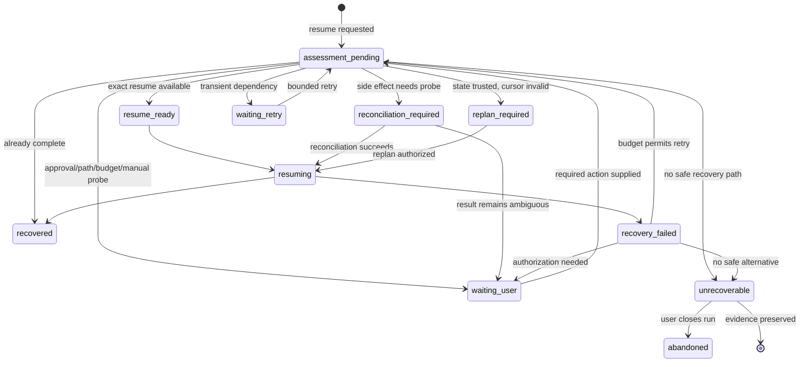

# Recovery Status, Boundary Coverage, and Fallback Plan

> 文档定位：typed recovery 状态与 fallback 的详细设计和实施记录。后续实施顺序以
> `COMPREHENSIVE_RECOVERY_BOUNDARY_PLAN.md` 为准。

## 1. 目标

本计划继续完善 OpenPilot 的恢复边界，并先回答一个比“调用 resume”更基础的问题：

> 当前运行究竟是否可恢复、在什么条件下可恢复、允许自动做到哪一步；如果不可恢复，
> 如何保留证据并安全地把任务交还给用户或新运行。

最终目标：

- 任意恢复请求都有一个严格、持久化、可解释的恢复状态；
- “能否恢复”和“采用何种恢复方式”不再由 `success`、`blocked` 或异常文本推断；
- exact resume、对账、重规划、等待外部条件和永久不可恢复有不同语义；
- 不可恢复时不静默重跑、不覆盖项目、不重置原预算、不伪装成原 run 的继续；
- UI、supervisor、checkpoint、trajectory 和最终报告使用同一状态；
- 每个新增自动恢复边界都有对应的副作用分类、对账探针和故障注入测试。

本计划扩展现有 checkpoint/controller，不重写任务框架，也不把 trajectory 变成恢复
真相源。

### 1.2 2026-08-02 实施状态

本轮已完成现有恢复边界的 Metadata-first 生产切片：typed recovery status、
recoverability、mode、automation policy、reason code、blocker/fallback、旧 payload 保守
迁移、缺失/损坏 checkpoint 兜底、上一有效代建议、CLI/trajectory/report 消费、run
单写者 lease 与 trajectory append lock。

尚未完成且不计入本轮：持久化 Recovery Bundle artifact、linked-new-run 执行、多步通用
session cursor、网络写和无探针对账命令。后续 phase 必须继续遵守
`docs/metadata/DEVELOPMENT_CONVENTIONS.md`，不能因为本切片完成而推断这些边界已开放。

### 1.1 Metadata-first 原则

恢复能力以 `Code/src/metadata/` 下的严格契约为骨架，实施顺序固定为：

1. 定义事实、身份、状态、原因码、允许动作和证据引用；
2. 用模型校验表达合法组合与迁移规则；
3. 让 checkpoint、controller、supervisor、trajectory、report 和 UI 消费同一模型；
4. 最后才实现具体恢复动作。

是否需要结构化不由“字段看起来像字符串”决定，而由它是否参与系统行为决定：

- 参与条件分支、权限判断、预算、重试、状态转换、审计聚合或跨进程协议的值，必须是
  enum、typed field 或严格嵌套 metadata；
- 身份、游标、副作用和证据必须是可校验字段，不能藏在 `details`、`attributes`、日志或
  prompt 中；
- 面向用户的说明文字可以保留，但只能由 typed 状态渲染，不能反向控制程序；
- 未被模型识别的状态采用保守策略，不允许根据相似文本猜测并自动恢复。

因此本计划不是给现有 controller 继续增加零散判断，而是先收敛恢复领域的 metadata
contract，再让执行逻辑变薄。

## 2. 当前问题

当前 `RuntimeResumeDecisionMetadata.decision` 包含：

- `exact_resume`
- `reconcile_then_resume`
- `replan`
- `blocked`

这四个值混合了三类概念：

1. **可恢复性**：现在是否具备继续条件；
2. **恢复方式**：继续、对账还是重规划；
3. **执行状态**：正在恢复、等待用户、恢复失败或已经完成。

`blocked` 尤其不明确，可能表示：

- API 暂时不可用，稍后可恢复；
- 预算耗尽，需要用户扩展；
- 项目路径错误，需要选择正确目录；
- 外部副作用不确定，需要人工对账；
- checkpoint 永久损坏，完全不可恢复。

这些情况需要完全不同的 supervisor 和 UI 行为，不能继续共享一个字符串。

### 2.1 当前自由字符串审计

| 当前值 | 当前问题 | Metadata-first 处理 |
| --- | --- | --- |
| `resume_status` | 普通结果字典字符串，没有统一合法集合 | 迁入 `RuntimeStateMetadata.recovery_status` |
| `decision` | 同时表达可恢复性和恢复方式 | 拆为 `recoverability` 与 `recovery_mode` |
| `reason` | 既给人阅读又被测试/调用方解释 | 增加 `reason_code`；文本只作 explanation |
| `next_action` | 自由文本，supervisor 无法安全执行 | 改为 typed fallback/action；文本只作 instructions |
| `checkpoint_status` | controller 私有字符串 | 建立 checkpoint availability/durability enum |
| `checkpoint_reason` | 只有文字，不能稳定聚合边界原因 | 增加 checkpoint reason code，保留 explanation |
| `verification_status` | `RuntimeStateMetadata` 中仍是裸字符串 | 收敛为严格 verification status enum |
| `completion_reason` | 完成、阻断、异常混在文本中 | 增加 completion/outcome code，文本只解释 |
| reconciliation failure strings | 多种失败最终都改写为 `blocked` | 建立 blocker kind、reason code 和 evidence refs |

本轮只处理恢复路径实际依赖的字段，不借机重构所有项目文本字段。超出恢复范围但被发现的
自由字符串进入 metadata debt 清单，后续按领域逐项收敛。

## 3. 核心状态模型

### 3.1 三个正交维度

#### A. `recovery_status`：运行当前处于什么恢复状态

建议在 `RuntimeStateMetadata` 增加严格枚举：

- `not_required`：正常执行，没有恢复请求；
- `assessment_pending`：已请求恢复，尚未完成预检；
- `resume_ready`：可以按已选模式继续；
- `reconciliation_required`：必须先对账副作用；
- `replan_required`：原执行游标不能继续，但可从可信状态重规划；
- `waiting_retry`：依赖或服务暂时不可用，可在预算内稍后重试；
- `waiting_user`：需要用户选择、批准、补充路径或扩展预算；
- `resuming`：恢复动作正在执行；
- `recovered`：恢复动作完成，已回到正常执行或完成态；
- `recovery_failed`：本次恢复尝试失败，但尚未判定永久不可恢复；
- `unrecoverable`：当前 run 已无安全恢复路径；
- `abandoned`：用户明确放弃恢复。

该字段是当前 operational state，必须进入 checkpoint、runtime report 和 task finish
summary。新运行默认 `not_required`。

#### B. `recoverability`：本次预检对“能否恢复”的结论

扩展 `RuntimeResumeDecisionMetadata`：

- `recoverable_now`：条件已满足，可继续 exact/reconcile/replan；
- `recoverable_after_action`：需要用户、外部系统或预算动作后才可恢复；
- `not_recoverable`：该 run/checkpoint 已不存在安全恢复路径；
- `already_complete`：无需恢复，直接返回已经完成的可信状态。

这是一次 resume attempt 的不可变评估结论，不代替 runtime 的当前状态。

#### C. `recovery_mode`：如果恢复，采用什么方式

保留并收紧现有语义：

- `return_completed`
- `exact_resume`
- `reconcile_then_resume`
- `replan_from_checkpoint`
- `retry_from_checkpoint`
- `user_assisted_resume`
- `none`

旧 `decision` 字段在兼容期映射到该字段，停止新增依赖，完成消费者迁移后再弃用。

### 3.2 自动化权限不能由 recoverability 推断

增加 `automation_policy`：

- `automatic_allowed`
- `approval_required`
- `manual_only`
- `forbidden`

例如文件哈希可确定的 reconcile 可以自动执行；外部部署即便理论上可恢复，也可能
必须 `manual_only`。

### 3.3 明确 reason code

恢复分支不得依赖自由文本 reason。建议严格 reason code 至少覆盖：

- `checkpoint_valid`
- `checkpoint_already_complete`
- `checkpoint_missing`
- `checkpoint_corrupt`
- `schema_incompatible`
- `runtime_version_incompatible`
- `project_root_mismatch`
- `project_drift_reconcilable`
- `project_drift_conflicting`
- `pending_read_only_call`
- `pending_file_mutation`
- `pending_validation`
- `indeterminate_command`
- `external_write_without_probe`
- `missing_stage_cursor`
- `permission_required`
- `budget_exhausted`
- `recovery_budget_exhausted`
- `dependency_temporarily_unavailable`
- `repeated_recovery_failure`

文本 reason 继续保留给用户阅读，但不控制分支。

## 4. Metadata 方案

优先扩展现有契约，不创建平行恢复框架。以下模型是恢复状态的唯一事实源；controller
不得维护语义重复的私有字符串状态。

本节受 `docs/metadata/DEVELOPMENT_CONVENTIONS.md` 约束。实现前必须完成其中的 metadata
impact note；下列嵌套值默认不是新的公开 `MetadataKind`。

### 4.0 现有契约复用与重复性判断

| 恢复事实 | 决定 | 原因 |
| --- | --- | --- |
| 当前恢复 operational state | 扩展 `RuntimeStateMetadata` | 属于同一可变运行状态所有者 |
| checkpoint 身份、边界、副作用和快照 | 复用/扩展 `RuntimeCheckpointMetadata` | 已是持久化恢复快照的权威契约 |
| 一次恢复预检结论 | 扩展 `RuntimeResumeDecisionMetadata` | 已有相同 attempt 生命周期，不再创建 assessment contract |
| 最终恢复结果投影 | 扩展 `RuntimeReportMetadata` | report 已是 runtime state 的派生审计视图 |
| 实际发生的执行异常 | 复用 `FailureMetadata` | failure 是已观察到的执行结果，不等同于预检 blocker |
| 待执行验证 | 复用 `VerificationPlanMetadata` | 不另建 recovery verification plan |
| blocker | `RuntimeResumeDecisionMetadata` 内严格嵌套值 | 没有独立生命周期，先不增加 `MetadataKind` |
| fallback | `RuntimeResumeDecisionMetadata` 内严格嵌套值 | 是该 assessment 的允许动作，不是第二决策源 |
| 恢复自动化权限 | decision 内 enum | 不复用工具审批所有者 `GuardDecisionMetadata` |
| 恢复/新 run 选择 | decision/fallback 内 typed action | 不复用项目迭代所有者 `AutonomyDecisionMetadata` |
| recovery bundle | artifact 引用 + 严格 manifest 值 | 先复用 artifact 边界；出现独立消费者后再评估公开 contract |

`GuardDecisionMetadata` 与恢复权限字段看起来相似，但前者的权威生产者是 tool/edit guard；
`AutonomyDecisionMetadata` 与 fallback 看起来相似，但前者属于项目主动迭代。语义和生命周期
不同，因此不合并，也不能让它们成为恢复状态的第二权威来源。

#### 本次生产切片 Metadata impact note

```text
Fact:
  现有 checkpoint 的当前恢复状态、可恢复性、恢复方式、自动化权限、结构化原因、
  blocker 和不可恢复 fallback。
Authoritative producer:
  AgentRuntimeController 的纯 resume preflight evaluator；运行中的 operational state
  由 RuntimeStateMetadata 持有。
Consumers:
  resume controller、checkpoint、runtime report、trajectory hooks、CLI；supervisor 后续
  只消费同一序列化 decision。
Lifecycle:
  checkpoint + event evidence；一次 RuntimeResumeDecisionMetadata 对应一个
  resume_attempt_id，RuntimeStateMetadata 保存当前 operational state。
Control impact:
  recovery、permission、budget、completion。
Existing contracts reviewed:
  RuntimeStateMetadata、RuntimeCheckpointMetadata、RuntimeResumeDecisionMetadata、
  RuntimeReportMetadata、RuntimeBudgetMetadata、FailureMetadata、VerificationPlanMetadata、
  GuardDecisionMetadata、AutonomyDecisionMetadata。
Decision:
  扩展现有 runtime family；blocker/fallback 使用 decision 内严格 nested value；复用现有
  failure、verification、identity、budget 和 evidence 字段；不新增 MetadataKind。
Why no duplicate source of truth is created:
  runtime state 是当前状态唯一权威；resume decision 是单次不可变评估；report/UI/trajectory
  只投影或序列化，不自行推断；保留旧 decision/resume_status 仅作兼容输出。
Serialization and migration:
  旧 decision payload 在读取时保守映射；未知或矛盾组合 fail closed；新 checkpoint 使用
  typed recovery fields，旧 checkpoint 使用默认 not_required。
Tests:
  enum/嵌套值 round-trip、非法组合、旧 payload 迁移、解释文本不影响控制、现有 preflight
  边界映射、reconciliation failure、CLI 和 trajectory 消费、全量回归。
Documentation updates:
  API、metadata catalog、session resume、supervisor、恢复计划和 implementation log。
```

本切片不开放新的 command/network 恢复边界，也不实现全局关系层。Recovery Bundle 先以
typed fallback 和可审计 evidence refs 表达；持久化 bundle artifact 属于后续独立切片。

### 4.1 `RuntimeStateMetadata`

新增：

- `recovery_status`
- `recovery_status_reason_code`
- `active_resume_attempt_id`

### 4.2 `RuntimeResumeDecisionMetadata`

新增：

- `recoverability`
- `recovery_mode`
- `automation_policy`
- `reason_code`
- `blocking_conditions: list[RecoveryBlocker]`
- `fallback: RecoveryFallback | None`
- `next_checkpoint_id`
- `retry_after_seconds`

`RecoveryBlocker` 是严格嵌套 `BaseModel`，至少包含：

- blocker kind；
- 是否可消除；
- 权威证据引用；
- 需要的 action/authorization；
- 影响的 tool/call/path。

### 4.3 `RecoveryFallback`

作为 resume decision 内的严格嵌套 `BaseModel`，不增加公开 `MetadataKind`，也不先增加
独立执行模块：

- `action`
- `reason_code`
- `requires_user_authorization`
- `preserve_original_run`
- `new_run_allowed`
- `recovery_bundle_ref`
- `instructions`

允许的 fallback action：

- `retry_later`
- `request_user_input`
- `request_budget_extension`
- `request_manual_reconciliation`
- `use_previous_valid_checkpoint`
- `export_recovery_bundle`
- `offer_new_linked_run`
- `terminate_preserving_evidence`
- `none`

控制分支的字段禁止放入 `details`、`attributes` 或日志字符串。

### 4.4 配套枚举与解释字段

枚举放在 metadata 层统一定义并导出，至少包括：

- `RecoveryStatus`
- `Recoverability`
- `RecoveryMode`
- `RecoveryAutomationPolicy`
- `RecoveryReasonCode`
- `RecoveryFallbackAction`
- `CheckpointStatus`
- `CheckpointReasonCode`
- `VerificationStatus`（迁移现有裸字符串）

Metadata 同时保留面向人的 `explanation`/`instructions`，但必须满足：

- code 决定分支，文本不决定分支；
- 相同 code 可以按 CLI/UI 场景渲染不同文本；
- 文本缺失不改变恢复行为；
- 未知 code 反序列化时保守失败或进入人工评估，不降级为字符串匹配。

### 4.5 所有权和传播

| Metadata | 创建者 | 持久化位置 | 主要消费者 |
| --- | --- | --- | --- |
| runtime recovery state | controller/state transition service | checkpoint/runtime report | controller、supervisor、UI |
| resume assessment | pure preflight evaluator | trajectory + resume result | controller、supervisor |
| blocker | 各 typed preflight check | resume assessment | fallback policy、UI |
| fallback | fallback policy evaluator | resume assessment/recovery bundle | supervisor、UI |
| checkpoint status/reason | checkpoint store/controller | checkpoint index + result | preflight、诊断 |
| recovery bundle manifest | fallback controller | artifact store | 用户、linked new run |

Trajectory 只记录这些 metadata 的事件快照和引用，不重新发明一套恢复状态。UI 只渲染，
不根据 `reason` 文本推断按钮或动作。

## 5. 状态转换



不允许：

- `unrecoverable -> resuming`；
- `waiting_user -> resuming` 而没有记录用户动作；
- `recovery_failed -> 新 run` 而没有显式 handoff；
- 恢复状态回到正常执行但未清理 indeterminate side effect。

## 6. 恢复边界矩阵

| 边界 | 默认 recoverability | 模式 | 自动化条件 | 不满足时 |
| --- | --- | --- | --- | --- |
| `task_normalized` | recoverable now | exact/replan | 项目、版本、预算一致 | waiting user 或 fallback |
| route/decomposition 已持久化 | recoverable now | exact | durable stage cursor 完整 | replan from checkpoint |
| LLM request 发出、无响应 | recoverable now | retry | 无副作用、请求可重新生成 | bounded retry |
| LLM response 已落 artifact、未应用 | recoverable now | exact apply | response hash/schema 有效 | replan |
| read tool prepared/in-flight | recoverable now | retry | 项目指纹一致 | replan |
| read result observed、未 applied | recoverable now | exact apply | call/result identity完整 | block on corruption |
| file mutation prepared | conditional | reconcile | 前/后哈希可判定 | manual reconciliation |
| file mutation observed | recoverable now | exact apply | observed result与当前哈希一致 | conflict/manual |
| file mutation applied | recoverable now | continue validation | pending validation完整 | replan或waiting user |
| validation pending | recoverable now | execute persisted plan | 命令已审批、环境一致 | waiting user/replan |
| validation observed、未 applied | recoverable now | exact apply | result artifact可信 | rerun only if idempotent |
| synthesis/report pending | recoverable now | exact/recompute | 输入 state hash一致 | recompute report |
| user approval/input pending | after action | user-assisted | request仍有效 | waiting user |
| budget stop | after action | user-assisted | 显式预算扩展 | preserve stop |
| read-only command in-flight | conditional | retry/probe | 工具声明幂等且cwd一致 | manual |
| mutating command in-flight | conditional | reconcile | 有工具专用探针/idempotency key | manual only |
| package install | conditional | reconcile | lockfile/env probe明确 | user approval |
| network read | conditional | retry | freshness策略允许 | retry later |
| network write/deploy/message | conditional | reconcile | 远端幂等键和读取探针 | manual only |
| checkpoint latest 损坏 | conditional | previous checkpoint | 前一代校验通过 | unrecoverable |
| 所有 checkpoint 损坏 | not recoverable | none | 无 | recovery bundle |
| schema/runtime 不兼容 | conditional | migrate | 有显式迁移器 | bundle/new linked run |
| project root 错误 | after action | none | 用户选择正确项目 | waiting user |
| 用户文件与预期冲突 | after action | manual/replan | 用户选择保留策略 | never overwrite |
| recovery budget 耗尽 | after action | none | 用户扩展预算 | preserve stop |

## 7. 不可恢复时的兜底策略

### 7.1 先封存原 run

进入 `unrecoverable` 后：

- 原 checkpoint、events、artifacts 保持不可变；
- run final status 使用明确的 `recovery_unavailable`，不是普通 `failed`；
- 记录最后可信 checkpoint、未确定副作用和不可恢复 reason code；
- 不再自动尝试 resume，也不继续消耗恢复预算。

### 7.2 生成 Recovery Bundle

生成一个非敏感、可下载/可审计的恢复包，至少包含：

- 原 goal 和身份；
- 最后可信 phase/subtask/step/call；
- 已完成、已验证和未完成事项；
- modified files、前后哈希和项目漂移摘要；
- pending/indeterminate side effects；
- 已消费与剩余预算；
- 不可恢复 reason code 和证据引用；
- 可供人工执行的检查步骤；
- 是否允许创建 linked new run。

不包含 API key、完整环境变量、未脱敏 prompt 或大对象正文。

### 7.3 新运行只能是显式 handoff

只有同时满足以下条件，才可向用户提供 `offer_new_linked_run`：

- 没有 indeterminate mutation/network side effect；
- 当前项目根已重新确认；
- 用户目标仍然有效；
- 已验证的旧结果可以作为 evidence 引用；
- 用户明确授权新预算和新 run。

新运行必须：

- 创建新的 `run_id` 和 `session_id`；
- 记录 `derived_from_run_id`、`derived_from_checkpoint_id`；
- 不声称自己是 exact resume；
- 不继承旧 run 的“已完成”状态；
- 仅复用经过验证的事实和产物引用。

### 7.4 有不确定副作用时禁止自动新跑

若可能已经发生部署、发消息、支付、删除、远端写入或不可判定命令：

- fallback 只能是 `request_manual_reconciliation` 或
  `terminate_preserving_evidence`；
- 不允许通过新 run 再执行一次；
- UI 必须展示目标系统、调用 ID、时间、已知证据和建议探针。

### 7.5 暂时不可恢复不等于永久不可恢复

以下进入 `recoverable_after_action`，不是 `not_recoverable`：

- API/网络临时不可用；
- 预算耗尽；
- 等待用户批准；
- 项目路径未确认；
- 可安装的运行依赖缺失；
- 有明确人工探针的副作用。

只有 checkpoint/版本/证据永久不可用，或副作用永远无法安全判定且用户拒绝人工处理，
才进入 `unrecoverable`。

## 8. Supervisor 策略

Supervisor 只能依据 typed recovery decision 行动：

- `recoverable_now + automatic_allowed`：在恢复预算内自动执行；
- `waiting_retry`：指数退避并受恢复预算、总时限和最大连续失败次数约束；
- `recoverable_after_action`：停止调度，等待明确事件；
- `manual_only`：只展示步骤，不执行；
- `not_recoverable`：封存并生成 fallback，不再循环重启。

连续失败不能一直返回 `blocked`。建议阈值：

- 同一 reason code 连续 3 次恢复失败；或
- recovery budget 耗尽；或
- 同一 checkpoint/project fingerprint 下没有新证据。

达到阈值后从 `recovery_failed` 转为 `waiting_user` 或 `unrecoverable`，由 reason code
决定，不使用异常次数猜测。

## 9. 分阶段实施

### Phase 0：状态契约和失败测试

- 先为 recovery status、recoverability、mode、automation policy、reason code、blocker、
  fallback、checkpoint status/reason 和 verification status 建立严格 metadata；
- 先完成 metadata impact note 和最近邻契约对照，默认扩展 runtime family，禁止先建
  平行 recovery family；
- 为跨字段合法组合增加 model validator，不把合法性散落在 controller 的 `if` 中；
- 建立 `resume_status`、旧 `decision`、裸 `verification_status` 和历史 checkpoint 的保守
  兼容映射；
- 建立自由字符串审计测试，禁止新增以 `reason`、`next_action`、异常文本或
  `attributes` 值控制恢复分支的代码；
- 测试所有合法/非法状态转换以及 JSON round-trip；
- 测试 UI、checkpoint、trajectory、report 使用同一 metadata，不从文本推断状态。

退出条件：任意 resume result 都能仅依靠 typed metadata 回答“现在能否恢复、下一动作是
什么、是否可自动”，控制路径不读取解释文本。

### Phase 1：统一预检评估器

- 把 `_resume_preflight()` 改为纯评估：输入 checkpoint/context/policy，输出 typed decision；
- 执行器只消费 decision，不再自行重新解释 reason；
- checkpoint store、project fingerprint、budget、permission、version 检查产生独立 blocker；
- trajectory 记录 assessment start/finish 和状态转换。

退出条件：同一 metadata 输入必定得到同一 typed decision，且无副作用、无字符串匹配。

### Phase 2：无外部副作用边界

- task normalized、route、decomposition、LLM request/response、read tool、synthesis/report；
- 增加 durable stage cursor 和 response/result apply marker；
- 已观察结果只应用一次，重试调用产生 `replay_of` 关联；
- 恢复后继续剩余 subtask，而不是重跑完整 session。

退出条件：每个边界的中断恢复与不中断执行得到等价 state/budget/result。

### Phase 3：验证与多步 tool plan

- 从当前单个 `pending_verification` 扩展为 bounded pending execution cursor；
- 持久化 required need、selection、依赖、完成证据和当前位置；
- 支持多个验证命令及失败后的 bounded replan；
- 完成状态必须证明所有 required pending actions 已消费。

退出条件：任意 tool 间中断后不丢命令、不重复已完成调用。

### Phase 4：命令和环境副作用注册表

- 每个工具声明 mutation class、idempotency strategy、reconciliation probe；
- 首批仅开放可证明的命令：测试、静态检查、只读 Git、确定性环境查询；
- 包安装使用 lockfile、环境 ID 和安装结果探针；
- 无注册契约的命令保持 manual only。

退出条件：不存在通用“重放上一命令”逻辑。

### Phase 5：网络与外部系统

- 区分 network read 和 network write；
- 写操作必须具备远端 idempotency key、查询接口和稳定资源 ID；
- 消息、部署、审批、支付、删除按工具独立开放；
- 无探针时进入 manual reconciliation。

退出条件：每个自动恢复外部工具都有真实沙箱/测试环境的重复调用证明。

### Phase 6：Fallback Controller 与 Recovery Bundle

- 实现封存、bundle、用户动作请求和 linked-new-run handoff；
- 新 run 建立显式 lineage metadata；
- indeterminate side effect 禁止自动 handoff；
- UI 提供“重试、补充信息、人工对账、创建新运行、放弃”中合法的子集。

退出条件：每个 not-recoverable reason code 都映射到唯一、安全、可解释的 typed
fallback；自由文本不改变映射。

### Phase 7：Supervisor、UI 和迁移

- supervisor 只消费 typed status/policy；
- bounded retry 和连续失败阈值；
- CLI 展示 recoverability、mode、blocker、fallback、预算和证据；
- 历史 checkpoint 迁移；缺字段时保守映射为 assessment pending/manual review；
- 更新 API、metadata catalog、loop/session/supervisor 协议和轨迹对齐文档。

## 10. 测试矩阵

### 10.1 状态契约

- 每个 status 的合法前驱/后继；
- recoverability、mode 和 automation policy 的合法组合；
- `not_recoverable` 不允许 exact/reconcile mode；
- `automatic_allowed` 不允许存在 unresolved manual blocker；
- 历史 payload 的保守迁移；
- reason/explanation 文本任意变化不影响 decision；
- 未知 enum/code 不触发自动恢复；
- metadata JSON round-trip 后状态、身份、证据和 fallback 不丢失。

### 10.2 边界故障注入

- 每个 checkpoint boundary 前后强制退出；
- LLM 请求前/响应后；
- tool prepared/observed/applied；
- pending plan 每个 command 之间；
- validation 成功写 checkpoint 前后；
- synthesis/report 写入前后；
- checkpoint store、trajectory recorder 和 artifact store 分别故障。

### 10.3 兜底

- latest 损坏回退上一代；
- 所有代损坏生成 bundle；
- wrong project 转 waiting user；
- budget exhausted 请求扩展；
- indeterminate external write 不允许新 run；
- safe unrecoverable run 可在用户授权后建立 linked new run；
- 原 run/checkpoint 不被新 run 修改。

### 10.4 真实端到端

至少覆盖：

1. 真实模型 coding task，多 subtask/多验证命令中断恢复；
2. 真实 CLI 新进程恢复，run/task/session/sequence 连续；
3. 文件只写一次，预算只计一次；
4. 临时模型不可用后 bounded retry；
5. 项目外部修改后 replan；
6. 不可恢复 checkpoint 生成 bundle；
7. 用户授权 linked new run，lineage 正确；
8. indeterminate external side effect 明确阻止自动新跑。

## 11. 完成定义

本计划只有同时满足以下条件才完成：

- 所有恢复结果都有 typed `recovery_status` 和 `recoverability`；
- `blocked` 不再承担所有暂停/不可恢复语义；
- supervisor 不读取错误文本决定恢复行为；
- controller 不保存与 metadata 重复且可能漂移的私有恢复状态；
- 恢复路径中所有影响控制流的字符串均已迁移或登记为明确 metadata debt；
- 支持的每个边界都通过确定性故障注入；
- 不支持的边界都有明确 blocker 和 fallback；
- 不可恢复 run 会封存并生成非敏感 Recovery Bundle；
- 新 run handoff 具有显式 lineage 和用户授权；
- indeterminate 副作用不会被自动重放或通过新 run 绕过；
- 全量测试和至少一条真实多步跨进程任务通过；
- API、metadata、trajectory、session resume、supervisor 和实施日志同步。

## 12. 推荐实施顺序

优先顺序：

1. Phase 0：明确状态；
2. Phase 1：统一评估；
3. Phase 6 的最小 fallback/bundle 骨架；
4. Phase 2–3：扩大本地、可确定恢复边界；
5. Phase 4：逐类开放命令；
6. Phase 5：最后处理外部写；
7. Phase 7：默认策略和迁移。

先做 fallback 骨架而不是等所有边界完成，是为了保证后续每增加一种恢复能力时，
失败路径从第一天起就有明确、安全的终点。
